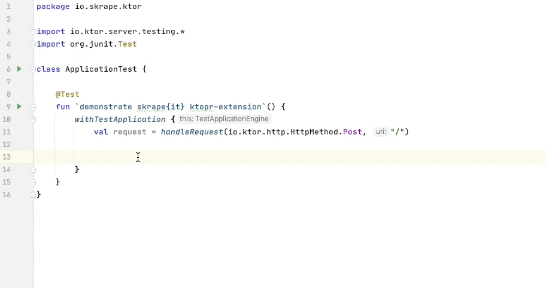

<a href="https://docs.skrape.it/docs/"><a/>
<a href="https://ktor.io/"><a/>

[](https://docs.skrape.it)
[](https://search.maven.org/search?q=g:it.skrape%20AND%20a:skrapeit-ktor&skrapeit-ktor=gav)
[](https://github.com/skrapeit/skrape.it/blob/master/LICENSE)
[](http://www.oracle.com/technetwork/java/javase/downloads/index.html)

[](https://travis-ci.org/skrapeit/skrapeit-ktor-extension)
[](https://codecov.io/gh/skrapeit/skrapeit-ktor-extension)
[](https://snyk.io/test/github/skrapeit/skrapeit-ktor-extension?targetFile=pom.xml)

[](https://www.paypal.me/skrapeit)
[](https://github.com/KotlinBy/awesome-kotlin)

[skrape{it} Ktor Extension](https://docs.skrape.it)
======================================================

An Extension to test [Ktor](https://ktor.io/) endpoints that produces HTML in a meaningful way.

_**[skrape{it}](http://www.skrape.it)**_ is a Kotlin-based HTML testing and web scraping library
that can be used seamlessly in Spring-Boot, Android or other JVM projects.
It places particular emphasis on ease of use, a high level of readability, 
attention to performance through the use of non-blocking operations and is not 
bound to a specific test runner.

### Example



### Setup
> Gradle (Kotlin DSL):
>```kotlin
>testCompile("it.skrape:skrapeit-core:+")
>testCompile("it.skrape:skrapeit-ktor:+")
>```

> Gradle (Groovy DSL):
>```groovy
>testCompile "it.skrape:skrapeit-core:+"
>testCompile "it.skrape:skrapeit-ktor:+"
>```

> Maven:
>```xml
><dependency>
>   <groupId>it.skrape</groupId>
>   <artifactId>skrapeit-core</artifactId>
>   <version>LATEST</version>
>   <scope>test</scope>
> </dependency>
><dependency>
>   <groupId>it.skrape</groupId>
>   <artifactId>skrapeit-ktor</artifactId>
>   <version>LATEST</version>
>   <scope>test</scope>
> </dependency>
>```

### Read the Docs

You'll always find documentation of the latest release at 
**[https://docs.skrape.it](https://docs.skrape.it)**
